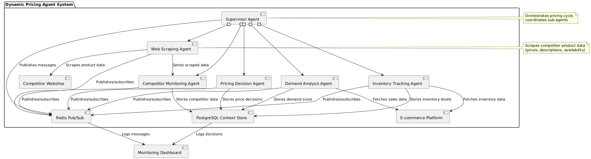

# Dynamic Pricing Agentic System

## Overview

The **Dynamic Pricing Agentic System** by **QAID Software Private Limited** is an enterprise-grade, multi-agent AI platform designed to automate and optimize product pricing for e-commerce businesses. Leveraging real-time competitor data, demand analytics, inventory levels, and advanced AI/LLM reasoning, the system enables dynamic, data-driven pricing decisions with minimal human intervention.

- **Multi-agent architecture**: Supervisor, Web Scraping, Competitor Monitoring, Pricing Decision, Demand Analysis, and Inventory Tracking agents.
- **Real-time data integration**: Scrapes competitor sites, analyzes demand, and monitors inventory.
- **Enterprise-ready**: Scalable, modular, and production-hardened with robust logging, monitoring, and API interfaces.

---

## Key Features

- **Autonomous Price Optimization**: Agents collaborate to set optimal prices based on market, demand, and inventory signals.
- **Competitor Intelligence**: Web Scraping Agent retrieves real-time competitor prices, descriptions, and availability.
- **Demand & Inventory Analytics**: Demand Analysis and Inventory Tracking Agents provide actionable insights for pricing.
- **Agentic Orchestration**: Supervisor Agent coordinates workflows using CrewAI and LangChain.
- **Decision Logging**: All agent decisions are logged for auditability and continuous improvement.
- **API-First**: FastAPI-based endpoints for integration with external systems.
- **Scalable & Secure**: Built for high throughput, reliability, and secure operations.

---

## Architecture



- **Agents**: Each agent is responsible for a specific domain (scraping, monitoring, pricing, etc.).
- **Communication**: Redis Pub/Sub for real-time messaging; PostgreSQL for persistent context.
- **LLM Integration**: Supports OpenAI GPT-4, Claude, Llama 3, and more via LangChain and CrewAI.
- **Vector Store**: Pinecone for embeddings and similarity search.
- **Monitoring**: Custom telemetry and decision logging for enterprise observability.

---

## Use Case Example

> **Automated Dynamic Pricing for E-Commerce**
>
> The system continuously scrapes competitor sites, analyzes demand and inventory, and updates product prices in real time. This maximizes revenue, maintains competitiveness, and reduces manual workload by 90%.

---

## API Endpoints

| Endpoint | Method | Description |
|----------|--------|-------------|
| `/` | GET | API root and metadata |
| `/health` | GET | Health check for all services |
| `/agents/supervisor` | POST | Run a pricing cycle for a product (input: `product_name`) |
| `/agents/supervisor/history/{product_id}` | GET | Retrieve pricing history for a product |
| `/agents/competitor-monitoring/similar/{product_name}` | GET | Find similar products using vector search |

**Example: Run Supervisor Agent**
```bash
curl -X POST http://localhost:8000/agents/supervisor \
  -H "Content-Type: application/json" \
  -d '{"product_name": "IQOO Z10 5G"}'
```

---

## Setup & Installation

### 1. Clone the Repository

```bash
git clone <your-repo-url>
cd dynamic-pricing-agentic-system
```

### 2. Install Dependencies

```bash
pip install -r requirements.txt
```

### 3. Configure Environment

- Copy `config.env.example` to `.env` and fill in your environment variables (PostgreSQL, Redis, Pinecone, API keys, etc.).
- Ensure PostgreSQL and Redis are running and accessible.

### 4. Initialize Database

```bash
psql <your-db-connection-string> -f scripts/schema.sql
```

### 5. Run the API Server

```bash
uvicorn src.api:app --host 0.0.0.0 --port 8000
```

---

## Database Schema

- See [`scripts/schema.sql`](scripts/schema.sql) for full schema.
- Tables: `products`, `competitor_prices`, `agent_decisions`, `price_history`, `sales_data`.

---

## Agentic Workflow

1. **Supervisor Agent** orchestrates the pricing cycle.
2. **Web Scraping Agent** scrapes competitor data and publishes to Redis.
3. **Competitor Monitoring Agent** processes and embeds data, stores in Pinecone and PostgreSQL.
4. **Demand & Inventory Agents** analyze sales and stock data.
5. **Pricing Decision Agent** computes optimal price and logs the decision.
6. **All decisions and actions are logged for traceability and learning.**

---

## Enterprise Features

- **Multi-Tenancy**: Supports isolated business units and pricing rules.
- **Extensible**: Add new agents, data sources, or LLMs with minimal changes.
- **Observability**: All agent actions and decisions are logged for compliance and analytics.
- **Security**: API key management, secure DB connections, and ethical scraping practices.

---

## Technology Stack

- **Python 3.10+**
- **FastAPI** (API)
- **LangChain, CrewAI** (Agent orchestration)
- **PostgreSQL** (Database)
- **Redis** (Pub/Sub messaging)
- **Pinecone** (Vector store)
- **Selenium, BeautifulSoup, Scrapy** (Web scraping)
- **Sentence Transformers** (Embeddings)
- **OpenAI, Claude, Llama 3** (LLMs)

---

## Contributing

Enterprise users and contributors are welcome! Please see the [CONTRIBUTING.md](CONTRIBUTING.md) for guidelines.

---

## License

This project is licensed under the MIT License.

---

## Contact

For enterprise support, integration, or consulting, please contact:

**QAID Software Private Limited**  
**Email:** admin@qaid.co.in

---

*For detailed architecture, use cases, and agent implementation, see the `docs/` directory.*
